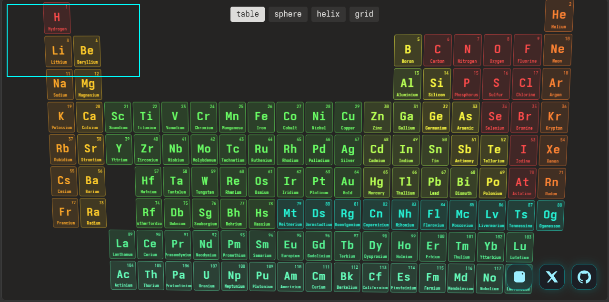
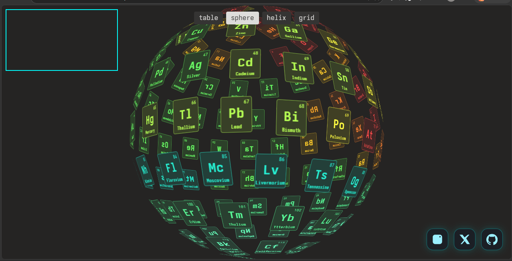
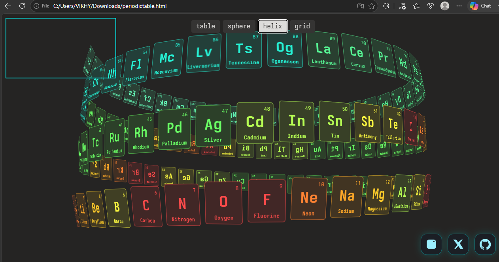
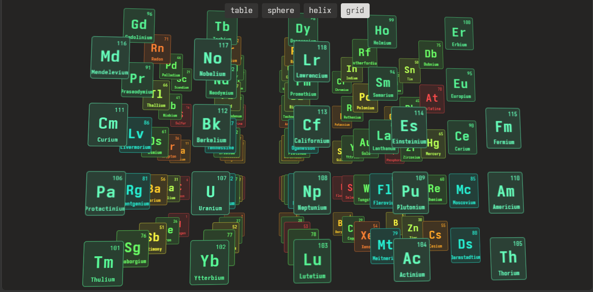

# 🧪 Interactive 3D Periodic Table

<p align="center">


</p>

<p align="center">
An immersive <b>3D Periodic Table</b> built with pure HTML, CSS and JavaScript. Experience chemistry through animated spatial layouts, real‑time hand gesture interaction, and smooth transitions powered by Anime.js.
</p>

<p align="center">

<a href="https://periodic-table-07.netlify.app" target="_blank">
  
</a>

</p>


---

# ✨ Highlights

- 🧪 Complete interactive periodic table.
- 🌍 Four visualization modes:
  - Table
  - Sphere
  - Helix
  - Grid
- 🤚 Hand gesture navigation using MediaPipe Hands.
- 🎥 Live webcam tracking.
- 🖱️ Interactive mouse-controlled camera.
- ⚡ Smooth spring animations with Anime.js.
- 📖 Expandable cards with scientific information.
- 🎨 Modern dark UI with color-coded element categories.
- 🚀 No build tools required — just open the HTML file.

---

# 📸 Screenshots

| Table | Sphere |
|-------|--------|
|  |  |

| Helix | Grid |
|-------|------|
|  |  |

---

# 🎮 Controls

| Action | Result |
|---------|--------|
| 🖱️ Move Mouse | Rotate the 3D scene |
| 👆 Click Element | Expand element information |
| 🤏 Pinch Gesture | Cycle between layouts |
| ⌨️ ESC | Close expanded card |

---

# 🏗️ Architecture

```text
User
 │
 ├── Mouse Input
 └── Webcam
        │
        ▼
 MediaPipe Hands
        │
 Gesture Detection
        │
        ▼
 Animation Controller
        │
        ▼
 Anime.js Layout Engine
        │
        ▼
 3D Periodic Table
```

---

# 🛠️ Tech Stack

- HTML5
- CSS3
- JavaScript (ES6 Modules)
- Anime.js
- Google MediaPipe Hands
- Camera Utils
- Drawing Utils

---

# ⚙️ Installation

```bash
git clone https://github.com/vikhy4t/interactive-periodic-table.git
cd interactive-periodic-table
```

Open `periodictable.html` (or your renamed `index.html`) in a modern Chromium-based browser and allow camera access to enable gesture controls.

---

# 📁 Project Structure

```text
Interactive-3D-Periodic-Table
│
├── periodictable.html
├── README.md
├── LICENSE
├── .gitignore
│
└── assets/
    └── screenshots/
        ├── table.png
        ├── sphere.png
        ├── helix.png
        └── grid.png
```


---

# 🚀 Roadmap

- [ ] Mobile gesture optimization
- [ ] Search and filter elements
- [ ] Element categories legend
- [ ] AR/VR exploration mode
- [ ] Educational quiz mode
- [ ] Audio feedback & accessibility improvements

---

# 🙏 Credits & Acknowledgements

This project was made possible by several incredible open-source projects.

### Libraries

- **Anime.js** — Powers the layout transitions, spring animations and motion system.
- **Google MediaPipe Hands** — Real-time hand tracking and gesture recognition.
- **MediaPipe Camera Utils** — Webcam capture utilities.
- **MediaPipe Drawing Utils** — Hand landmark rendering.

### Attribution

This project integrates and extends these technologies with custom interaction logic, interface refinements, gesture-based layout switching, styling, UI enhancements, and project integration by **Vikhyat**.

If you build upon this project, please consider keeping the acknowledgements and supporting the original open-source libraries.

---

# 📄 License

This project is licensed under the **MIT License**.

---

# 👨‍💻 Author

**Vikhyat**

- GitHub: https://github.com/vikhy4t
- Instagram: https://instagram.com/vikhy4t
- X (Twitter): https://x.com/vikhy4t

---

<p align="center">
If you enjoyed this project, consider giving it a ⭐ on GitHub.
</p>
